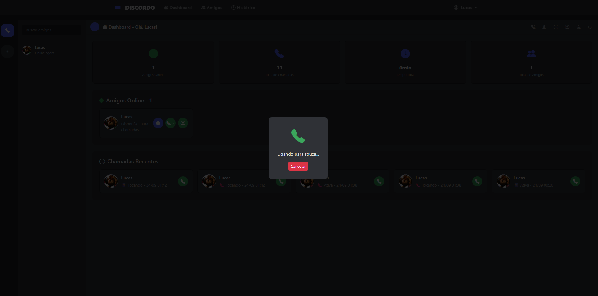
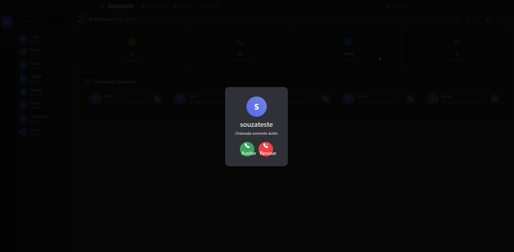

Discordo – Demo

Discordo é uma plataforma de comunicação em tempo real, inspirada no Discord, desenvolvida como projeto de portfólio.
O sistema permite chamadas de vídeo e áudio P2P, troca de mensagens, gerenciamento de amigos e notificações instantâneas via WebRTC + WebSocket.

🎯 Funcionalidades

👤 Usuários & Perfis – login, registro, avatares e status online

👥 Amizades – adicionar, aceitar/recusar, amigos em comum

📞 Chamadas P2P – áudio/vídeo, controles de mídia e histórico

💬 Mensagens – chat em tempo real com histórico persistente

🎨 UI Moderna – interface responsiva inspirada no Discord

🌐 Notificações em tempo real – chamadas, mensagens e solicitações

🖼️ Demonstração

## 🔐 Autenticação

### Tela de Login

### Tela de Cadastro

## 🏠 Dashboard & Lista de Amigos

### Dashboard Principal

### Perfil do Usuário

## 📞 Chamadas em Vídeo P2P

### Iniciando uma Chamada

### Recebendo uma Chamada

### Chamada em Andamento

## 💬 Mensagens em Tempo Real

### Interface de Chat

🛠️ Tecnologias

Backend: Django + Django REST Framework + Django Channels

Frontend: WebRTC, HTML5, CSS3, JS Vanilla, Bootstrap

Banco de Dados: PostgreSQL / SQLite (dev)

Infraestrutura: Redis, Docker, Railway/Heroku

🏗️ Arquitetura
Frontend (WebRTC)  ⇆  Django API (REST)  ⇆  WebSocket (Channels)
        │                         │                    │
        └────────── PostgreSQL ───┘                    │
                              └───────────── Redis ────┘
