# KyVoice – Real-Time Communication Platform

KyVoice é uma plataforma de comunicação em tempo real desenvolvida para chamadas de áudio e vídeo com baixa latência, comunicação em grupo via servidores, compartilhamento de tela e mensagens instantâneas.

O projeto foi pensado para escalabilidade e arquitetura moderna, servindo tanto como demonstração de portfólio full-stack quanto como base para produtos comerciais, plataformas corporativas ou soluções educacionais.

## Sumário

- [Visão Geral](#visão-geral)
- [Funcionalidades](#funcionalidades)
- [Demonstração Visual](#demonstração-visual)
- [Tecnologias Utilizadas](#tecnologias-utilizadas)
- [Arquitetura](#arquitetura)
- [Execução em Ambiente Local](#execução-em-ambiente-local)
- [Deploy em Produção](#deploy-em-produção)
- [API e Comunicação em Tempo Real](#api-e-comunicação-em-tempo-real)
- [Segurança](#segurança)
- [Aplicações Possíveis](#aplicações-possíveis)
- [Status do Projeto](#status-do-projeto)
- [Licença](#licença)

## Visão Geral

KyVoice permite comunicação síncrona e assíncrona por meio de:

- Chamadas diretas (1-para-1)
- Salas de voz e vídeo com múltiplos participantes
- Compartilhamento de tela em tempo real
- Chat integrado às chamadas
- Sistema de usuários, amizades e servidores
- Notificações em tempo real

Toda a comunicação em tempo real é baseada em WebRTC e WebSocket, garantindo desempenho e experiência fluida ao usuário.

## Funcionalidades

### Usuários e Perfis

- Registro e autenticação
- Perfis personalizáveis (avatar, bio e banner)
- Status de presença (online, offline, em chamada)
- Preferências de áudio, vídeo e privacidade

### Sistema de Amizades

- Envio, aceitação e recusa de solicitações
- Lista de amigos
- Visualização de amigos em comum
- Permissões baseadas em relacionamento

### Servidores e Salas

- Criação e gerenciamento de servidores
- Salas de voz e texto
- Chamadas com múltiplos participantes
- Entrada e saída dinâmica de usuários
- Controle básico de participantes

### Chamadas em Tempo Real

- Chamadas diretas entre usuários
- Chamadas em grupo por servidor
- Áudio e vídeo em tempo real
- Compartilhamento de tela
- Controle individual de microfone e câmera
- Notificações instantâneas
- Histórico de chamadas

### Mensagens

- Chat em tempo real
- Histórico persistente
- Marcação de mensagens como lidas
- Integração com chamadas e servidores

### Interface

- Interface responsiva e moderna
- Layout inspirado em aplicações de comunicação consolidadas
- Experiência consistente em desktop e mobile

## Demonstração Visual

### Autenticação

#### Página de início
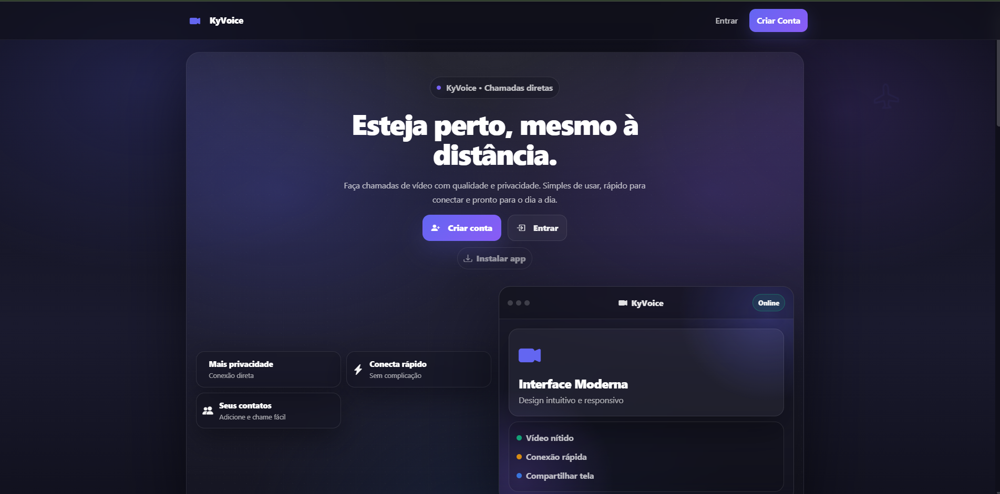

#### Login
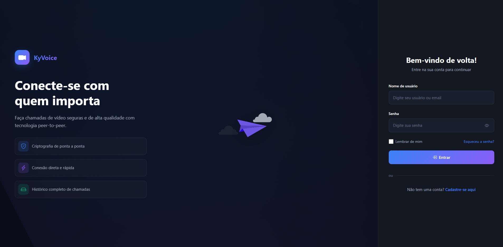

#### Cadastro
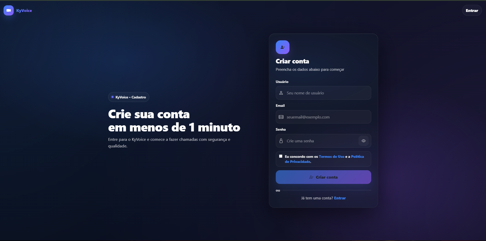

### Dashboard e Perfil

#### Dashboard principal
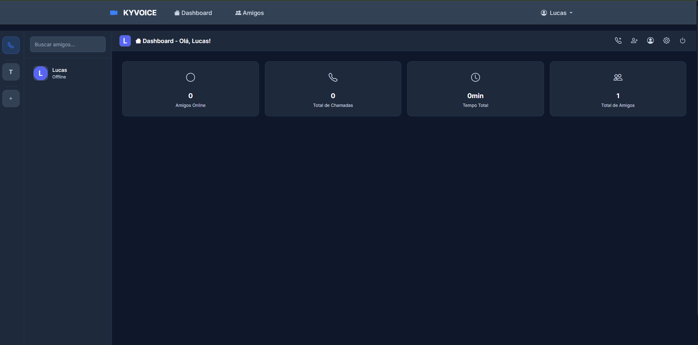

#### Perfil do usuário
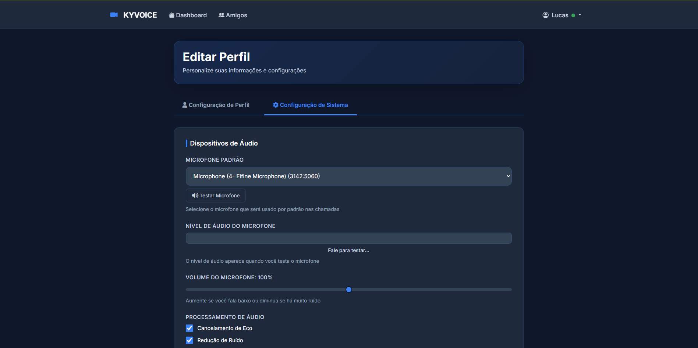

### Servidores

#### Convite para servidor
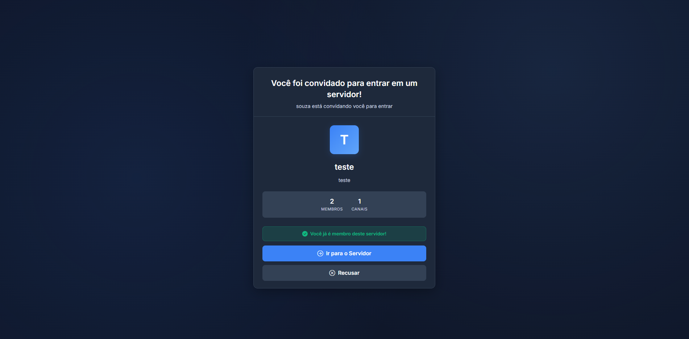

### Chamadas

#### Início de chamada


#### Recebimento de chamada
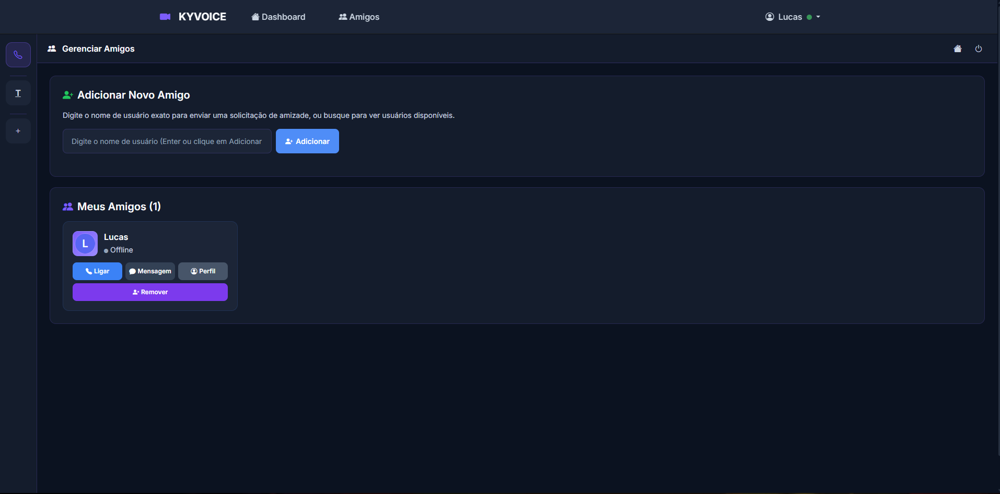

#### Chamada ativa
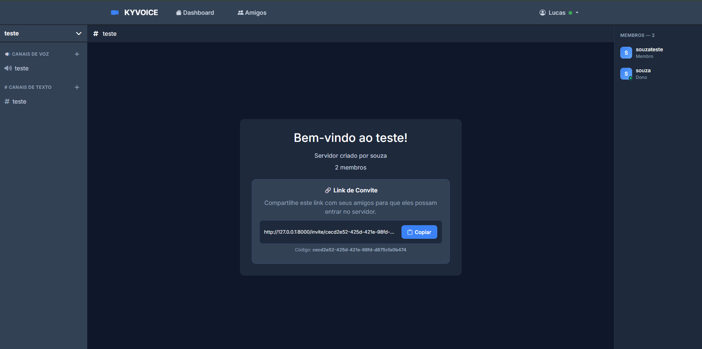

#### Chamada em servidor
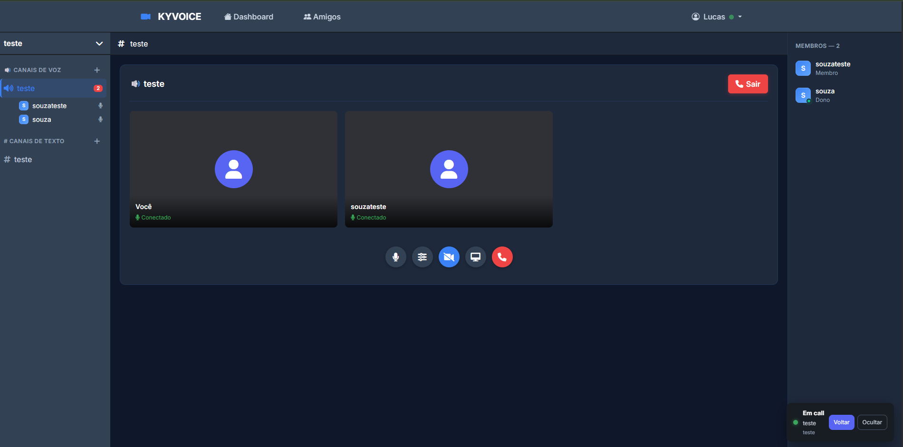

#### Transmissão no servidor
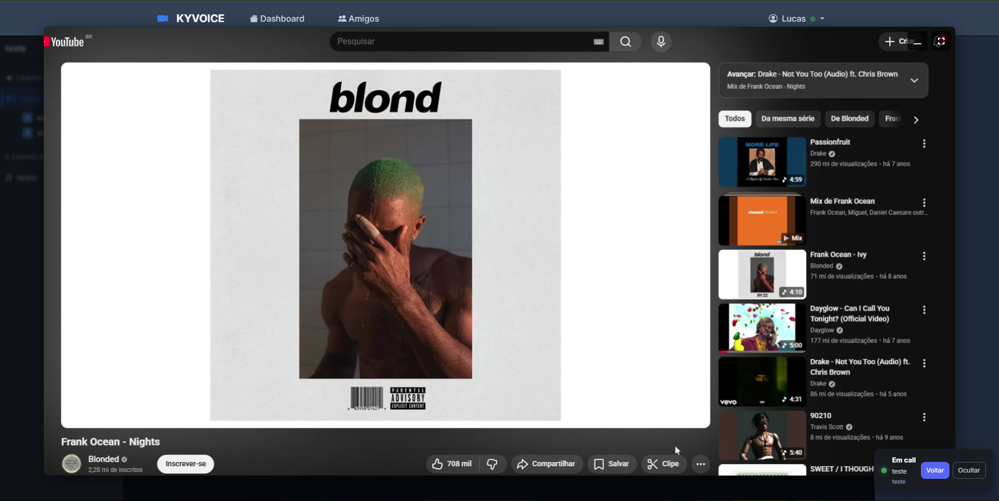

### Chat

#### Interface de chat
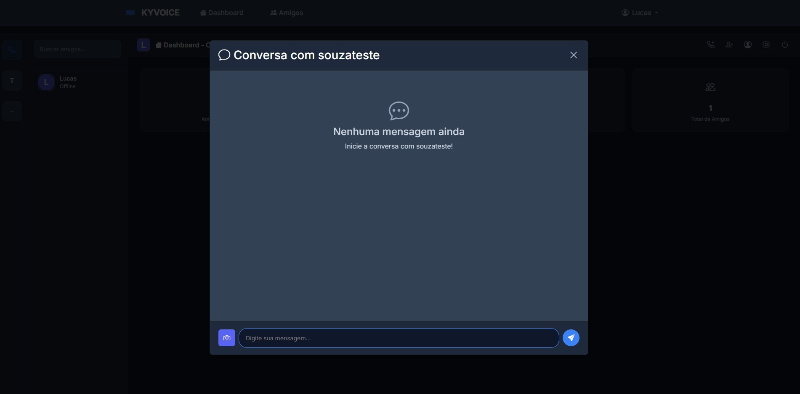

## Tecnologias Utilizadas

### Backend

- Django
- Django REST Framework
- Django Channels
- ASGI (Daphne)

### Frontend

- JavaScript (Vanilla)
- WebRTC
- HTML5
- CSS3
- Bootstrap

### Banco de Dados

- PostgreSQL (produção)
- SQLite (desenvolvimento)

### Infraestrutura

- Redis
- Docker
- Gunicorn
- Railway / Heroku

## Arquitetura

A aplicação segue uma arquitetura desacoplada, separando responsabilidades entre comunicação HTTP e comunicação em tempo real.

```
Frontend (WebRTC / JS)
        │
        ▼
Django REST API (HTTP)
        │
        ▼
WebSocket Layer (Django Channels)
        │
        ├── Redis (gerenciamento de canais)
        └── PostgreSQL (dados persistentes)
```

Essa abordagem permite escalabilidade horizontal e facilidade de manutenção.

## Execução em Ambiente Local

### Pré-requisitos

- Python 3.11 ou superior
- Redis
- Git

### Passo a Passo

```bash
git clone <repo>
cd kyvoice
python -m venv venv
```

Ativação do ambiente virtual:

```bash
# Linux/Mac
source venv/bin/activate

# Windows
venv\Scripts\activate
```

Instalação e execução:

```bash
pip install -r requirements.txt
cp env.example .env
python manage.py makemigrations
python manage.py migrate
python manage.py createsuperuser
python manage.py collectstatic
python manage.py runserver
```

Aplicação disponível em `http://localhost:8000`.


### Execução

```bash
gunicorn project.wsgi:application --bind 0.0.0.0:8000
daphne project.asgi:application --bind 0.0.0.0 --port 8001
```

## API e Comunicação em Tempo Real

### REST API (exemplos)

```text
POST /accounts/login/
POST /accounts/register/
GET  /api/friends/
POST /api/friend-requests/
GET  /api/calls/
POST /api/calls/
GET  /api/calls/history/
```

### WebSocket

```text
/ws/voice/{room_id}/
/ws/notifications/
```

## Segurança

- Autenticação obrigatória
- Controle de permissões por usuário, amizade e servidor
- Validação de dados no backend
- Uso recomendado de HTTPS em produção

## Aplicações Possíveis

KyVoice pode ser utilizado como base para:

- Plataformas de comunicação corporativa
- Ferramentas educacionais e EAD
- Sistemas de atendimento remoto
- Comunidades privadas
- Aplicações de videoconferência personalizadas

## Status do Projeto

Projeto ativo, com foco em evolução contínua, qualidade de código e boas práticas de arquitetura.

## Licença

MIT License
