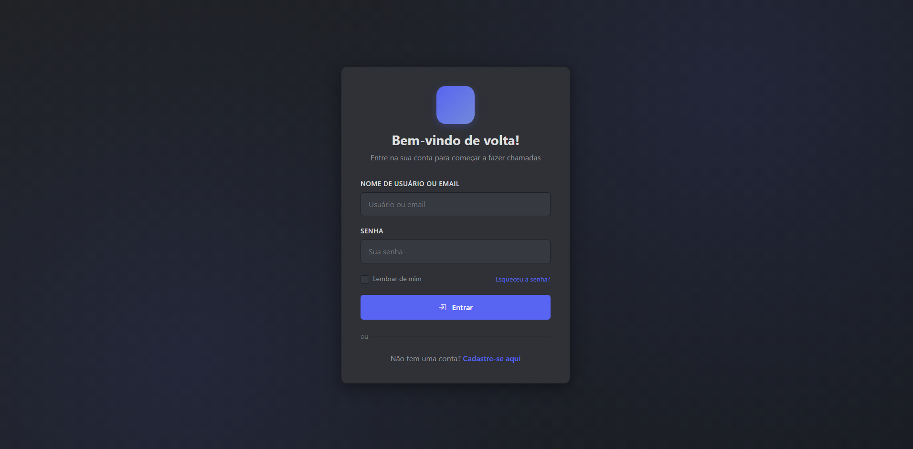
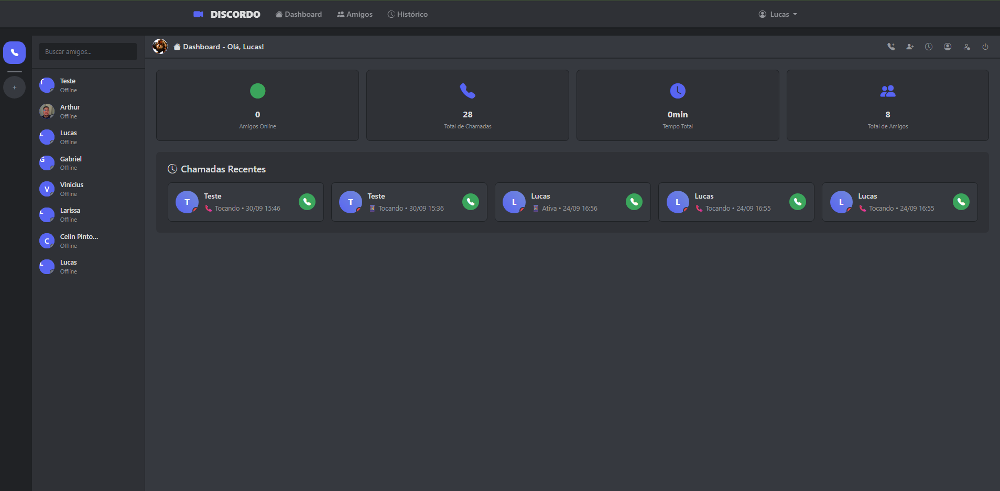
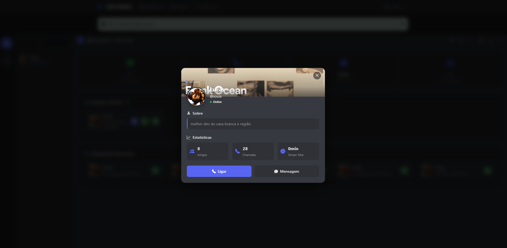
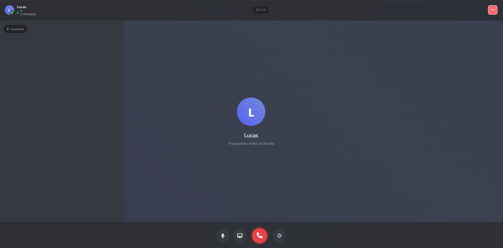
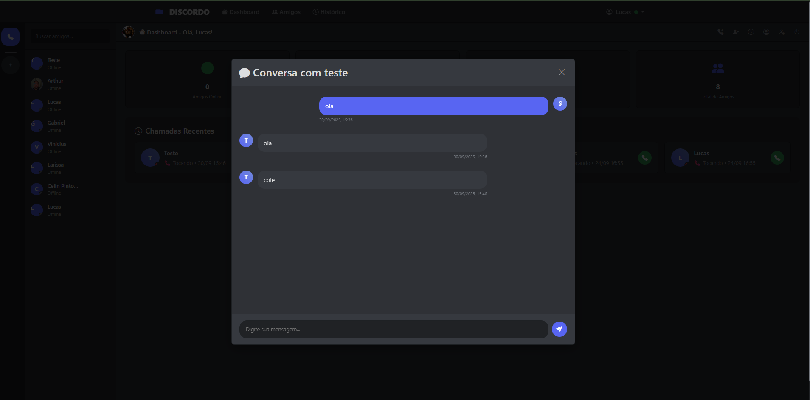

🎧 Discordo – Demo

Discordo is a real-time communication platform inspired by Discord, built as a portfolio project.
It features peer-to-peer audio/video calls, instant messaging, friend management, and live notifications powered by WebRTC and WebSocket.

🚀 Features

Users & Profiles – Registration, login, avatars, and online status

Friendships – Add, accept/decline requests, view mutual friends

P2P Calls – Audio/video calls, media controls, and call history

Messaging – Real-time chat with persistent history

Modern UI – Responsive interface inspired by Discord

Instant Notifications – For calls, messages, and friend requests

🔐 Authentication
Login Screen

Registration Screen

🏠 Dashboard & Friends
Main Dashboard

User Profile

📞 Peer-to-Peer Video Calls
Starting a Call

Receiving a Call

Active Call

💬 Real-Time Messaging
Chat Interface

🛠️ Tech Stack

Backend: Django, Django REST Framework, Django Channels

Frontend: WebRTC, HTML5, CSS3, Vanilla JS, Bootstrap

Database: PostgreSQL / SQLite (development)

Infrastructure: Redis, Docker, Railway/Heroku
