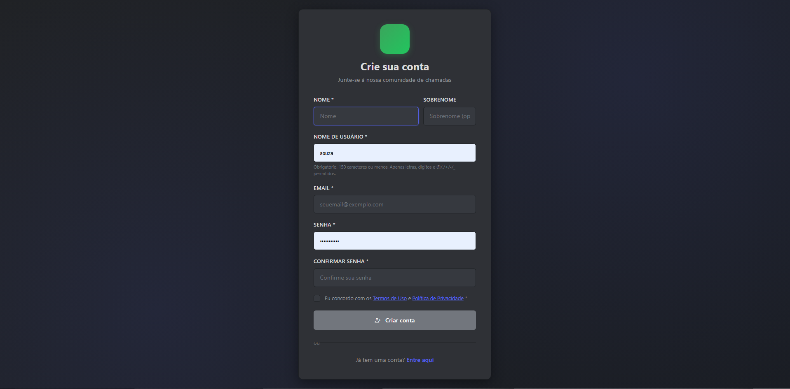

📞 Discordo - Real-Time Communication Platform Demo
Stack: Django · PostgreSQL · Redis · Django Channels · WebRTC · Vanilla JS
A Discord-inspired real-time communication platform built as a portfolio project. Features P2P video/audio calls, instant messaging, friend management, and real-time notifications via WebRTC + WebSocket.

🎯 Features

👤 User Authentication - Login, registration, avatars, and online status
👥 Friend System - Add friends, accept/decline requests, mutual friends
📞 P2P Calls - Video/audio calling with media controls and call history
💬 Real-Time Messaging - Instant chat with persistent history
🎨 Modern UI - Discord-inspired responsive interface
🌐 Live Notifications - Real-time alerts for calls, messages, and requests

🖼️ Screenshots
🔐 Authentication
<table>
  <tr>
    <td> <b>Login</b></td>
    <td> <b>Registration</b></td>
  </tr>
</table>
🏠 Dashboard & Profile
<table>
  <tr>
    <td> <b>Main Dashboard</b></td>
    <td> <b>User Profile</b></td>
  </tr>
</table>
📞 P2P Video Calls
<table>
  <tr>
    <td> <b>Initiating Call</b></td>
    <td> <b>Receiving Call</b></td>
  </tr>
  <tr>
    <td colspan="2" align="center"> <b>Active Call</b></td>
  </tr>
</table>
💬 Real-Time Messaging
<table>
  <tr>
    <td align="center"> <b>Chat Interface</b></td>
  </tr>
</table>

🛠️ Tech Stack

Backend: Django, Django REST Framework, Django Channels
Frontend: WebRTC, HTML5, CSS3, Vanilla JavaScript, Bootstrap
Database: PostgreSQL (production) / SQLite (development)
Infrastructure: Redis, Docker, Railway

🏗️ Architecture
Frontend (WebRTC) ⇆ Django API (REST) ⇆ WebSocket (Channels)
         │                    │                   │
         └──────── PostgreSQL ┘                   │
                           └────────── Redis ─────┘

🚀 Live Demo

Note: This is a portfolio demonstration project showcasing full-stack development skills including real-time communication, WebRTC implementation, and modern web technologies.

